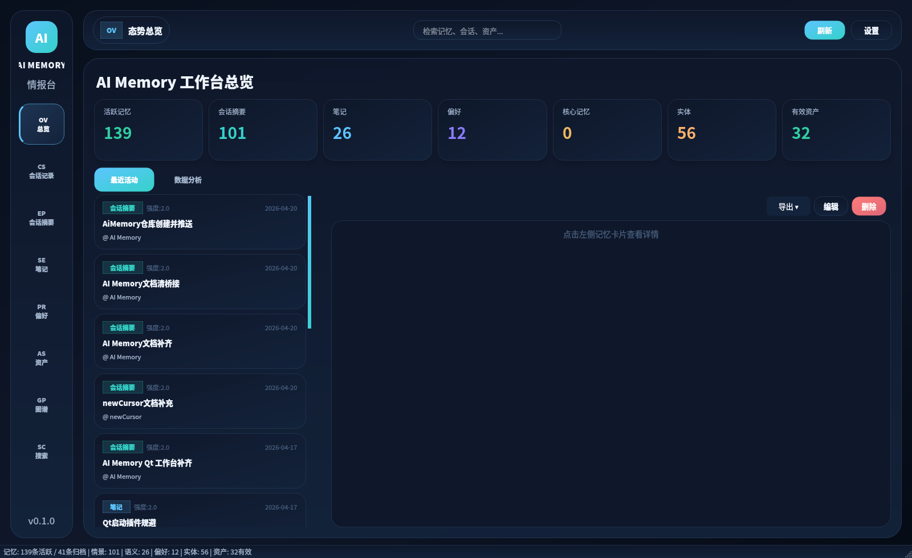
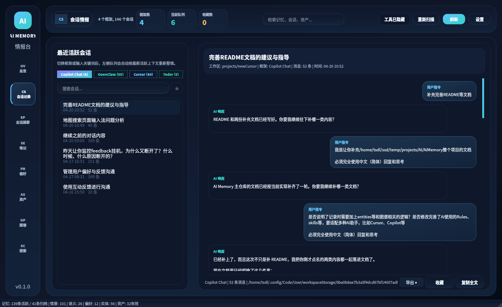
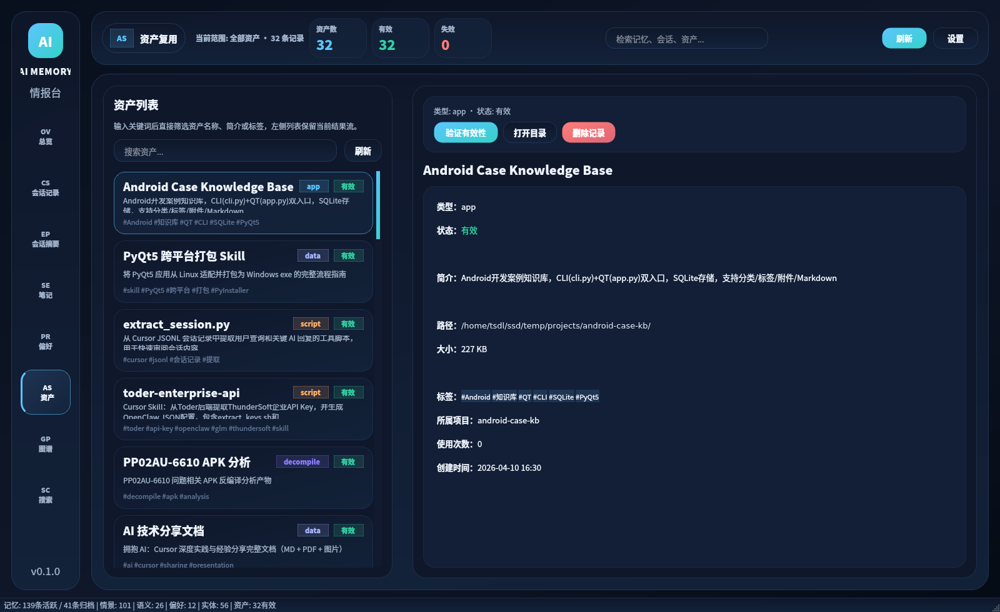
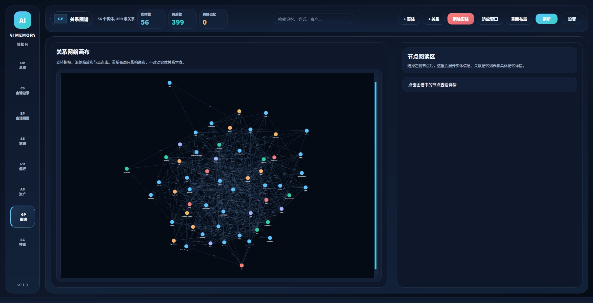
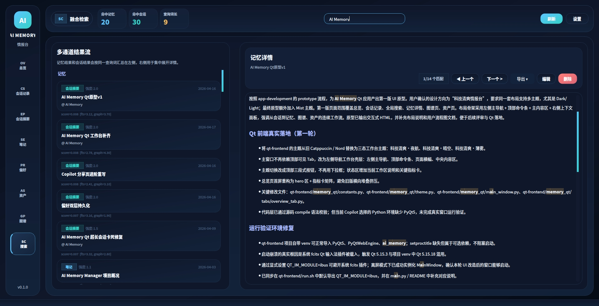

# AI Memory System

本地优先的 AI 长期记忆工作台。这个仓库把记忆存储、资产管理、可读层、会话记录解析、Qt 桌面前端和一套面向 AI 集成的文档放在同一个工程里，方便把“记住什么、怎么查、怎么复用、怎么可视化管理”串成完整闭环。

当前仓库里可直接运行和验证的部分主要有三块：

- 后端本地引擎与 CLI
- Qt 可视化前端
- AI 集成与 UI 原型文档

## 仓库概览

| 目录 | 作用 |
| --- | --- |
| `backend/` | 本地记忆引擎、SQLite 存储、检索索引、资产管理、CLI 和图谱重建工具 |
| `qt-frontend/` | PyQt5 桌面前端，当前为“科技清爽情报台”工作台壳层 |
| `docs/` | 架构、实现、路线图、AI 集成和 Cursor 配套说明 |
| `ui-prototype-v1/` | HTML 原型与布局说明，用于前端视觉和信息架构评审 |
| `tmp/` | 临时产物与实验文件 |

## 当前能力

### 后端

- 三类核心记忆：会话摘要、笔记、偏好
- 资产注册、查找、使用计数和失效标记
- 本地可读层与 SQLite 数据库存储
- 检索通道包含全文、时间、图谱以及可选向量检索
- 支持从现有记忆回抽实体并重建关系图谱

### Qt 前端

- 8 个主工作区：总览、会话记录、会话摘要、笔记、偏好、资产、图谱、搜索
- 会话记录支持 Cursor、OpenClaw、Toder、Copilot
- 记忆编辑支持强度调整、批量操作和详情阅读
- 图谱支持节点查看、关系展示和重新布局
- 当前主题为“科技清爽·夜航 / 晴空 / 薄雾”三态工作台

### 集成与文档

- 提供面向 AI Agent 的集成指南
- 提供 Cursor 侧规则与 Skill 模板
- 保留 Qt 前端原型与交互说明，便于继续收敛设计方向

## 真实界面截图

以下截图来自 AI Memory Qt 应用本体（非网页原型），用于展示当前可运行版本的真实界面。

### 总览工作台



### 会话记录



### 资产管理



### 实体图谱



### 融合搜索



## 快速开始

### 1. 安装后端

```bash
cd backend
pip install -e .
```

如果你需要向量检索或开发依赖：

```bash
pip install -e ".[all]"
```

### 2. 做一次健康检查

```bash
cd backend
python -m ai_memory --check
```

### 3. 通过 CLI 操作记忆

```bash
cd backend
python cli.py working
python cli.py recall --query "interactive_feedback"
python cli.py rebuild-graph --dry-run
```

### 4. 启动 Qt 前端

```bash
cd qt-frontend
pip install -r requirements.txt
python3 main.py
```

Linux 下如果遇到 Qt 输入法插件冲突，优先使用仓库自带启动脚本：

```bash
cd qt-frontend
./run.sh
```

## 文档导航

| 文档 | 说明 |
| --- | --- |
| `docs/DESIGN.md` | 整体架构设计 |
| `docs/IMPLEMENTATION.md` | 代码级实现说明 |
| `docs/ROADMAP.md` | 分阶段路线图 |
| `docs/PHASE6_DESIGN.md` | Qt 前端设计文档 |
| `docs/AI_INTEGRATION.md` | AI 侧接入方式与行为约束 |
| `docs/cursor-integration/ai-memory.mdc` | Cursor 规则模板 |
| `docs/cursor-integration/SKILL.md` | Cursor Skill 模板 |
| `ui-prototype-v1/docs/prototypes/` | 前端原型、布局说明和用户流 |

## 使用建议

### 如果你要先验证后端是否可用

1. 先跑 `python -m ai_memory --check`
2. 再用 `python cli.py working`、`recall`、`remember` 验证数据链路
3. 如果已有大量历史记忆，可先做一次 `python cli.py rebuild-graph --dry-run`

### 如果你要先看桌面界面

1. 先阅读 `qt-frontend/README.md`
2. 使用 `qt-frontend/run.sh` 启动，避免 Linux 上 Qt 输入法插件冲突
3. 如需继续打磨视觉或页面信息架构，再看 `ui-prototype-v1/docs/prototypes/`

### 如果你要把它接进 AI 工作流

1. 先看 `docs/AI_INTEGRATION.md`
2. 如果目标是 Cursor，再补读 `docs/cursor-integration/`
3. 先用 CLI 跑通记忆操作，再把规则与 Skill 接到 Agent 侧

## 说明

- 根目录旧文档中曾出现过的 `integration/` 路径已不再作为当前仓库结构的一部分，现以 `docs/AI_INTEGRATION.md` 和 `docs/cursor-integration/` 为主。
- 健康检查入口与数据操作入口是分开的：`python -m ai_memory --check` 负责检查环境与数据库，`backend/cli.py` 负责实际记忆与资产操作。
- Qt 前端 README 和后端 README 已分别补充当前真实结构、主题和命令说明，建议配合阅读。

## License

MIT
