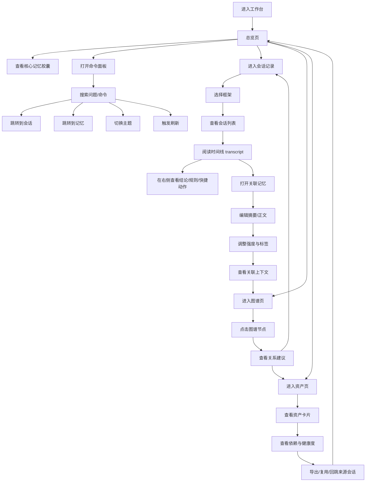
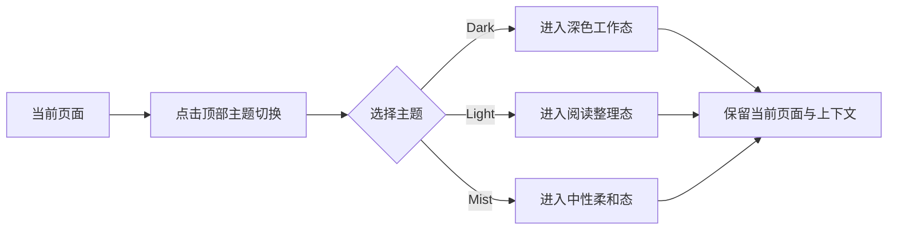

# AI Memory Qt UI 原型用户流程

## 核心流程

## 关键场景说明

### 1. 从总览页进入当前最重要问题

- 用户先在总览页看到高价值记忆胶囊和最近活动。
- 如果某条活动值得继续处理，可以直接跳到对应会话或记忆。
- 如果用户还不确定从哪里开始，可以用命令面板搜索问题描述。

### 2. 从会话页沉淀记忆

- 用户在会话页查看真实时间线，而不是碎片化工具日志。
- 当某段对话值得保留时，直接进入记忆详情页。
- 记忆页右侧元信息区用于补充强度、项目归属和复用建议。

### 3. 从记忆页扩展到图谱

- 用户在记忆详情里看到关联上下文后，可以一键跳到图谱页。
- 图谱页帮助确认“这条知识与哪些解析器、页面、交互行为相关”。
- 如果关系不完整，后续可以扩展为补边或推荐连线操作。

### 4. 从图谱页进入资产复用

- 某些图谱节点对应实际资产，如 HTML 原型、规则集合、分享页。
- 点击后跳到资产页，查看健康度、依赖和导出能力。
- 资产不只是文件查看，而是继续复用和打包的入口。

### 5. 全局状态反馈流程

- 用户触发刷新或重新扫描时：按钮进入忙碌态。
- 页面局部显示骨架或轻加载占位，而不是整页冻结。
- 成功后底部 Toast 提示，形成完整反馈闭环。
- 空状态必须给下一步建议，例如导入、扫描、创建、关联。

## 主题切换流程

## 原型评审建议

- 先看总览页和会话页，确认信息密度与导航路径是否符合你的工作方式。
- 再看记忆页和图谱页，确认上下文切换是不是足够顺滑。
- 最后看资产页和主题切换，确认视觉方向与复用逻辑是否满意。